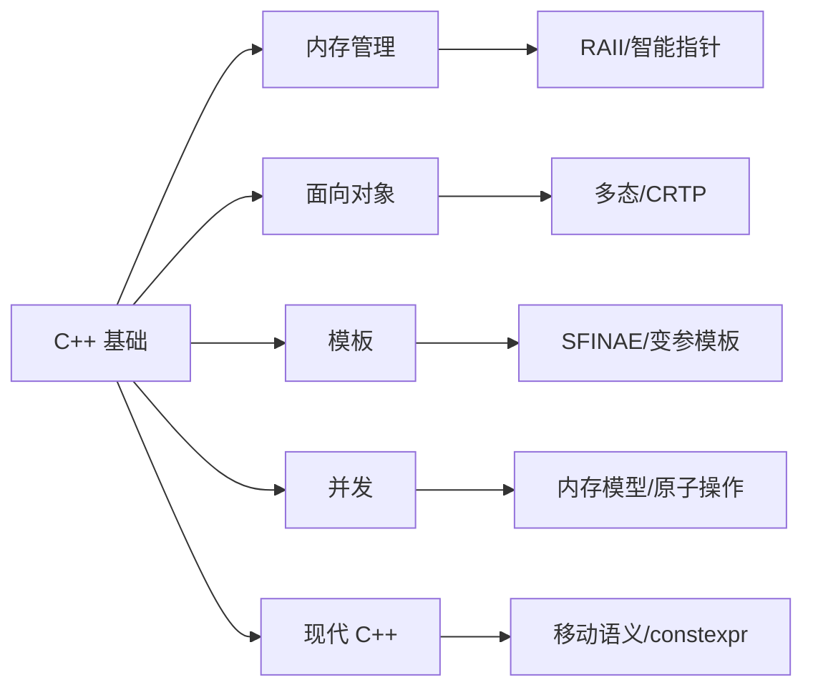

# 为 **C++ 程序员**（尤其是 C++11/14/17） 设计的 **50 道基础理论知识问答清单**

以下是专为 **C++ 程序员**（尤其是 C++11/14/17） 设计的 **50 道基础理论知识问答清单**，涵盖 **内存管理、面向对象、模板、并发、现代 C++ 特性** 等核心领域。每道题均附 **精准答案 + 关键解析**，适合面试准备、知识自查或团队培训。

---

## 📚 一、语言基础与语法（10 题）

### Q1: `#include <iostream>` 和 `#include "myheader.h"` 有什么区别？
**A**:  
- `<...>`：从**系统路径**（如 `/usr/include`）搜索头文件  
- `"..."`：先从**当前目录**搜索，再查系统路径  
✅ **关键**：自定义头文件用 `""`，标准库用 `<>`

---

### Q2: 什么是未定义行为（UB）？举两个例子。
**A**:  
UB 是标准未规定结果的行为，**程序可能崩溃、静默错误或看似正常**。  
例子：  
1. 访问悬空指针：`int* p = new int(5); delete p; *p = 10;`  
2. 有符号整数溢出：`int x = INT_MAX; x++;`  
✅ **关键**：UB 是 C++ 最危险陷阱，编译器可任意优化

---

### Q3: `const` 在成员函数后的作用是什么？
**A**:  
表示该函数**不修改对象状态**（`this` 指针为 `const T*`）。  
```cpp
class A {
    int x;
public:
    int get() const { return x; } // OK
    void set(int v) { x = v; }    // 错误！若在 const 对象上调用
};
```
✅ **关键**：`const` 成员函数可被 `const` 对象调用

---

### Q4: `static` 关键字在类内和全局作用域的区别？
**A**:  
| 作用域 | 含义 |
|--------|------|
| **全局** | 文件作用域（内部链接），其他文件不可见 |
| **类内** | 所有对象共享的成员（需在类外定义） |
```cpp
// global.cpp
static int g_var; // 仅本文件可见

class A {
public:
    static int s_count; // 所有 A 对象共享
};
int A::s_count = 0; // 必须在类外定义
```

---

### Q5: 什么是 RAII？为什么重要？
**A**:  
**Resource Acquisition Is Initialization**（资源获取即初始化）：  
- 用**对象生命周期**管理资源（内存、文件句柄等）  
- 析构函数自动释放资源  
✅ **关键**：C++ 内存安全基石（如 `std::unique_ptr`、`std::lock_guard`）

---

### Q6: `nullptr` 相比 `NULL` 有什么优势？
**A**:  
- `NULL` 通常是 `#define NULL 0`（整数）  
- `nullptr` 是**类型安全的空指针常量**（`std::nullptr_t`）  
```cpp
void f(int); 
void f(char*);

f(NULL);   // 调用 f(int)！歧义
f(nullptr); // 正确调用 f(char*)
```

---

### Q7: 什么是 POD 类型（Plain Old Data）？
**A**:  
满足以下条件的类型：  
- 无用户自定义构造函数/析构函数  
- 无虚函数  
- 所有非静态成员是 public 且为 POD  
✅ **关键**：POD 可安全 `memcpy`，与 C 兼容

---

### Q8: `explicit` 关键字的作用？
**A**:  
禁止**隐式类型转换**（通常用于单参数构造函数）  
```cpp
class String {
public:
    explicit String(int size); // 禁止 int → String 隐式转换
};

String s = 10; // 错误！需 String s(10);
```

---

### Q9: `sizeof` 运算符在运行时还是编译时计算？
**A**:  
**编译时计算**（除非操作数是 VLA，但 C++ 不支持 VLA）。  
✅ **关键**：`sizeof` 不会执行表达式（如 `sizeof(func())` 不调用 `func`）

---

### Q10: 什么是 ODR（One Definition Rule）？
**A**:  
**单一定义规则**：  
- 任何变量/函数/类在**整个程序中只能有一个定义**  
- 头文件中可包含**声明**，但**定义**需唯一（内联函数/模板除外）  
✅ **关键**：违反 ODR 导致链接错误或未定义行为

---

## 💾 二、内存管理（8 题）

### Q11: `new`/`delete` 与 `malloc`/`free` 的核心区别？
**A**:  
| 特性 | `new`/`delete` | `malloc`/`free` |
|------|----------------|-----------------|
| **构造/析构** | 调用 | 不调用 |
| **类型安全** | 是（返回 `T*`） | 否（返回 `void*`） |
| **重载** | 可重载 | 不可重载 |

---

### Q12: 什么是内存泄漏？如何检测？
**A**:  
- **定义**：动态分配的内存未释放  
- **检测工具**：  
  - Linux: `valgrind --leak-check=full ./app`  
  - Windows: Visual Studio Diagnostic Tools  
✅ **关键**：智能指针（`unique_ptr`/`shared_ptr`）可避免 90% 泄漏

---

### Q13: `std::unique_ptr` 和 `std::shared_ptr` 的使用场景？
**A**:  
| 智能指针 | 所有权模型 | 适用场景 |
|----------|------------|----------|
| `unique_ptr` | **独占所有权** | 函数返回资源、RAII 封装 |
| `shared_ptr` | **共享所有权** | 多对象共享同一资源（如缓存） |
⚠️ **注意**：`shared_ptr` 有引用计数开销，避免循环引用（用 `weak_ptr`）

---

### Q14: 什么是 placement new？何时使用？
**A**:  
在**预分配内存**上构造对象：  
```cpp
char buffer[sizeof(MyClass)];
MyClass* obj = new(buffer) MyClass; // placement new
obj->~MyClass(); // 必须手动析构
```
✅ **关键**：用于内存池、嵌入式系统等高性能场景

---

### Q15: 为什么 `delete this` 危险？
**A**:  
- 若对象在栈上创建：`delete this` → 未定义行为  
- 若多次 `delete this`：重复释放 → 崩溃  
✅ **安全条件**：  
  1. 对象必须由 `new` 创建  
  2. 成员函数内不再访问 `this`  
  3. 调用者不知对象已销毁

---

### Q16: 什么是 dangling pointer（悬空指针）？如何避免？
**A**:  
- **定义**：指向已释放内存的指针  
- **避免方法**：  
  1. 使用智能指针  
  2. 释放后置 `nullptr`：`delete p; p = nullptr;`  
  3. 避免返回局部变量地址

---

### Q17: 栈内存 vs 堆内存的核心区别？
**A**:  
| 特性 | 栈 | 堆 |
|------|-----|-----|
| **分配速度** | 极快（指针移动） | 较慢（系统调用） |
| **生命周期** | 作用域结束自动释放 | 手动管理（或智能指针） |
| **大小限制** | 小（通常 MB 级） | 大（GB 级） |
| **碎片** | 无 | 可能产生 |

---

### Q18: 什么是内存对齐（Alignment）？为什么重要？
**A**:  
- **定义**：数据在内存中的起始地址是其大小的倍数（如 `int` 4 字节对齐）  
- **重要性**：  
  - 某些 CPU（如 ARM）要求对齐，否则崩溃  
  - 对齐提升缓存效率  
✅ **C++11+**：`alignas(32) int arr[100];` 强制对齐

---

## 🧱 三、面向对象（8 题）

### Q19: 虚函数如何实现多态？
**A**:  
- 编译器为含虚函数的类生成 **vtable**（虚函数表）  
- 对象包含 **vptr**（指向 vtable 的指针）  
- 调用虚函数时：`obj->vptr->func()`  
✅ **关键**：动态绑定（运行时决定调用哪个函数）

---

### Q20: 为什么基类析构函数必须是虚函数？
**A**:  
- 若基类析构函数非虚：  
  ```cpp
  Base* p = new Derived();
  delete p; // 仅调用 ~Base()，~Derived() 未调用 → 资源泄漏！
  ```
- **虚析构函数**确保派生类析构函数被正确调用

---

### Q21: 什么是纯虚函数？包含纯虚函数的类叫什么？
**A**:  
- **纯虚函数**：`virtual void func() = 0;`（无实现）  
- **抽象类**：包含至少一个纯虚函数的类（不能实例化）  
✅ **用途**：定义接口规范

---

### Q22: 什么是 CRTP（奇异递归模板模式）？用途？
**A**:  
- **定义**：派生类作为模板参数传递给基类  
  ```cpp
  template<typename Derived>
  class Base {
      void interface() {
          static_cast<Derived*>(this)->implementation();
      }
  };
  class Derived : public Base<Derived> { ... };
  ```
- **用途**：**编译时多态**（避免虚函数开销），用于策略模式、静态多态

---

### Q23: 什么是对象切片（Object Slicing）？
**A**:  
- **定义**：将派生类对象赋值给基类对象时，**派生部分被截断**  
  ```cpp
  Derived d;
  Base b = d; // d 的派生成员丢失！
  ```
- **避免**：始终用**指针或引用**传递多态对象

---

### Q24: 什么是 PIMPL（Pointer to Implementation）？
**A**:  
- **定义**：将私有成员移到独立实现类，通过指针访问  
  ```cpp
  // header.h
  class Widget {
      class Impl;
      std::unique_ptr<Impl> pImpl;
  };
  // source.cpp
  class Widget::Impl { /* 私有成员 */ };
  ```
- **优点**：  
  1. 减少编译依赖（修改 Impl 不需重编用户代码）  
  2. 隐藏实现细节

---

### Q25: 什么是 NVI（Non-Virtual Interface）模式？
**A**:  
- **定义**：公有非虚函数调用私有虚函数  
  ```cpp
  class Base {
  public:
      void interface() { // 非虚
          before();
          do_interface(); // 虚函数
          after();
      }
  private:
      virtual void do_interface() = 0;
  };
  ```
- **优点**：控制调用流程（如加锁、日志）

---

### Q26: 什么是菱形继承问题？如何解决？
**A**:  
- **问题**：多重继承导致基类被重复继承  
  ```cpp
  class A { int x; };
  class B : public A {};
  class C : public A {};
  class D : public B, public C {}; // D 有两个 A::x！
  ```
- **解决**：**虚继承**  
  ```cpp
  class B : virtual public A {};
  class C : virtual public A {}; // D 只有一个 A
  ```

---

## 🔧 四、模板与泛型编程（8 题）

### Q27: 函数模板和模板函数的区别？
**A**:  
- **函数模板**：模板代码（如 `template<typename T> void f(T);`）  
- **模板函数**：函数模板的**实例化版本**（如 `f<int>`）  
✅ **关键**：模板是“蓝图”，模板函数是“具体产品”

---

### Q28: 什么是 SFINAE？用途？
**A**:  
- **Substitution Failure Is Not An Error**：模板参数替换失败**不报错**，而是移除候选  
- **用途**：编译时类型检查（C++17 前常用）  
  ```cpp
  template<typename T>
  auto test(T t) -> decltype(t.begin(), void()) { // 若 T 无 begin()，SFINAE 移除此重载
      std::cout << "Container\n";
  }
  ```

---

### Q29: `typename` 和 `class` 在模板参数中可互换吗？
**A**:  
- **基本可互换**：`template<typename T>` ≡ `template<class T>`  
- **例外**：  
  - 模板模板参数必须用 `class`：  
    ```cpp
    template<template<typename> class Container> // 不能用 typename
    ```
  - 依赖类型名前必须用 `typename`：  
    ```cpp
    typename T::iterator it; // 不能用 class
    ```

---

### Q30: 什么是完美转发（Perfect Forwarding）？
**A**:  
- **定义**：函数模板保持参数的**值类别**（左值/右值）传递给另一函数  
- **实现**：  
  ```cpp
  template<typename T>
  void wrapper(T&& arg) {
      foo(std::forward<T>(arg)); // 完美转发
  }
  ```
- **关键**：`T&&` 是**万能引用**（Universal Reference），`forward` 保留值类别

---

### Q31: 什么是特化（Specialization）？全特化 vs 偏特化？
**A**:  
| 类型 | 语法 | 示例 |
|------|------|------|
| **全特化** | 所有模板参数指定 | `template<> class A<int> { ... };` |
| **偏特化** | 部分参数指定 | `template<typename T> class A<T*> { ... };` |
⚠️ **注意**：函数模板**不能偏特化**（只能重载）

---

### Q32: `auto` 和模板类型推导规则相同吗？
**A**:  
- **基本相同**，但 `auto` **忽略顶层 const 和引用**：  
  ```cpp
  const int x = 5;
  auto y = x; // y 是 int（非 const int）
  template<typename T> void f(T t); 
  f(x);       // T 推导为 int（同 auto）
  ```
- **例外**：`auto&` 保留引用和 const

---

### Q33: 什么是变参模板（Variadic Templates）？
**A**:  
- **定义**：接受**任意数量/类型**参数的模板  
  ```cpp
  template<typename... Args>
  void print(Args... args) {
      ((std::cout << args << " "), ...); // C++17 折叠表达式
  }
  ```
- **用途**：`std::make_shared`, `std::thread` 构造

---

### Q34: C++17 结构化绑定（Structured Binding）是什么？
**A**:  
- **定义**：将 tuple/struct/pair 解包到多个变量  
  ```cpp
  std::map<int, string> m;
  for (const auto& [key, value] : m) { // 结构化绑定
      std::cout << key << ": " << value;
  }
  ```
- **优点**：替代 `std::get<0>(t)`，代码更清晰

---

## ⚡ 五、并发与多线程（8 题）

### Q35: `std::thread` 对象如果不 join 或 detach 会发生什么？
**A**:  
- **析构时抛出异常**（`std::terminate` 被调用）  
- **必须显式处理**：  
  ```cpp
  std::thread t(func);
  t.join(); // 或 t.detach();
  ```

---

### Q36: 什么是数据竞争（Data Race）？如何避免？
**A**:  
- **定义**：多个线程**同时访问同一内存**，且至少一个写操作，**无同步**  
- **避免方法**：  
  1. 互斥锁（`std::mutex`）  
  2. 原子操作（`std::atomic`）  
  3. 无共享数据（消息传递）

---

### Q37: `std::mutex` 和 `std::atomic` 如何选择？
**A**:  
| 场景 | 选择 |
|------|------|
| **简单类型**（int, bool） | `std::atomic`（无锁，高性能） |
| **复合操作**（如 push/pop） | `std::mutex`（保证原子性） |
| **保护大段代码** | `std::mutex` |

---

### Q38: 什么是死锁？如何避免？
**A**:  
- **定义**：两个线程互相等待对方释放锁  
- **避免策略**：  
  1. **锁排序**：总是按固定顺序获取锁  
  2. **超时机制**：`std::timed_mutex::try_lock_for`  
  3. **RAII**：用 `std::lock_guard` 自动释放

---

### Q39: `std::async` 的 `launch::async` 和 `launch::deferred` 区别？
**A**:  
| 策略 | 行为 |
|------|------|
| `launch::async` | **立即创建新线程**执行任务 |
| `launch::deferred` | **延迟执行**（调用 `.get()` 时才在当前线程执行） |
✅ **默认策略**：`async | deferred`（由系统决定）

---

### Q40: 什么是内存序（Memory Order）？`memory_order_relaxed` 适用场景？
**A**:  
- **定义**：控制原子操作的**内存可见性和顺序**  
- `memory_order_relaxed`：  
  - 仅保证原子性，**不保证顺序**  
  - **适用**：计数器（如统计点击次数）  
  - **禁用**：需要同步的场景（如生产者-消费者）

---

### Q41: `std::condition_variable` 为什么需要配合 `while` 循环？
**A**:  
- **虚假唤醒**（Spurious Wakeup）：即使未 notify，线程也可能唤醒  
- **正确用法**：  
  ```cpp
  std::unique_lock lock(mtx);
  while (!ready) { // 必须用 while，不能 if
      cv.wait(lock);
  }
  ```

---

### Q42: C++11 内存模型的核心是什么？
**A**:  
- **定义**：标准化多线程行为（之前 C++ 无官方内存模型）  
- **核心概念**：  
  - happens-before 关系  
  - synchronizes-with 关系  
  - 原子操作内存序  
✅ **意义**：使多线程代码可移植、可预测

---

## 🚀 六、现代 C++ 特性（8 题）

### Q43: 移动语义（Move Semantics）解决了什么问题？
**A**:  
- **问题**：临时对象拷贝开销大（如返回 vector）  
- **解法**：  
  - **移动构造函数**：`vector(vector&& other)`  
  - **转移资源所有权**（而非深拷贝）  
  ```cpp
  std::vector<int> create() { return std::vector(1000000); } // RVO 或移动
  ```

---

### Q44: 什么是 RVO（Return Value Optimization）？
**A**:  
- **定义**：编译器优化，**省略返回值的拷贝/移动**  
- **C++17 强制 RVO**：  
  ```cpp
  MyClass func() { return MyClass(); } // 直接构造在调用者位置
  ```
- **效果**：即使没有移动构造函数，也高效

---

### Q45: `override` 和 `final` 关键字的作用？
**A**:  
| 关键字 | 作用 |
|--------|------|
| `override` | 显式标记重写虚函数（编译器检查是否真重写） |
| `final` | 禁止派生类重写此虚函数，或禁止继承此类 |
```cpp
class Base {
    virtual void f() final; // 不能被重写
};
class Derived final : public Base { }; // 不能被继承
```

---

### Q46: 什么是委托构造函数（Delegating Constructors）？
**A**:  
- **定义**：一个构造函数调用同一类的另一个构造函数  
  ```cpp
  class A {
      A(int x) { ... }
      A() : A(42) {} // 委托给 A(int)
  };
  ```
- **优点**：减少代码重复

---

### Q47: `constexpr` 函数的要求是什么？
**A**:  
- **C++11**：函数体只能有 `return` 语句  
- **C++14+**：可包含循环、局部变量等（但必须能在编译时求值）  
- **用途**：编译时计算（如数组大小）  
  ```cpp
  constexpr int square(int x) { return x * x; }
  int arr[square(5)]; // OK
  ```

---

### Q48: 什么是统一初始化（Uniform Initialization）？
**A**:  
- **语法**：用 `{}` 初始化所有类型  
  ```cpp
  std::vector<int> v{1, 2, 3}; // 列表初始化
  MyClass obj{arg1, arg2};     // 直接初始化
  ```
- **优点**：  
  1. 避免“最 vexing parse”问题  
  2. 禁止窄化转换（`int x{3.14};` 编译错误）

---

### Q49: `noexcept` 的作用是什么？
**A**:  
- **声明函数不抛异常**：  
  ```cpp
  void f() noexcept; // 承诺不抛异常
  ```
- **好处**：  
  1. 编译器可优化（如移动操作若 `noexcept`，`vector` 优先移动而非拷贝）  
  2. 提升异常安全性

---

### Q50: C++17 的 `if constexpr` 解决了什么问题？
**A**:  
- **问题**：模板中条件编译需 SFINAE 或宏（复杂）  
- **解法**：编译时 if  
  ```cpp
  template<typename T>
  void process(T t) {
      if constexpr (std::is_integral_v<T>) {
          // 仅当 T 是整数类型时编译此分支
      }
  }
  ```
- **优点**：代码清晰，无需 SFINAE

---

## 📌 总结：知识图谱



> 💡 **建议使用方式**：  
> - 面试前快速自查  
> - 团队技术分享题库  
> - 新人培训考核清单  

如果需要 **PDF 打印版** 或 **Anki 记忆卡片**，我可以为你生成！只需说：“**导出 PDF**” 😊

# C++11/17 基础理论知识问答清单

以下是为 C++ 程序员（重点关注 C++11/17 标准）设计的100道基础理论知识问答清单，覆盖语法特性、标准库、理念、底层原理等，适合自测或面试考察。每题均为单独的问题，你可以要求后续添加参考答案。

---

### C++ 基础理论知识问答清单（C++11/17）

1. C++ 与 C 的主要区别有哪些？
2. 简述 C++ 的四大基本特性。
3. 什么是 RAII？它的作用是什么？
4. C++11 引入了哪些主要的新特性？
5. C++17 新增了哪些重要的语言特性？
6. 什么是 nullptr？与 NULL 有什么区别？
7. C++ 中引用与指针的区别是什么？
8. 右值引用的作用是什么？
9. 描述一下 move 语义与 std::move 的作用。
10. 什么是完美转发？如何实现？
11. 解释 auto 关键字的用法。
12. 智能指针有哪些？分别适用于哪些场景？
13. shared_ptr 和 unique_ptr 的区别是什么？
14. weak_ptr 有什么作用？为什么需要它？
15. 描述一下显式类型转换 explicit 关键字的作用。
16. enum class 与传统 enum 有哪些区别？
17. constexpr 关键字的用途是什么？
18. lambda 表达式在 C++11/17 中如何使用？
19. 描述 noexcept 关键字的用途。
20. =delete 和 =default 的含义以及应用场景。
21. 初始化列表（initializer_list）的作用与应用。
22. 描述 C++ 的拷贝构造函数和移动构造函数的调用时机。
23. C++11/17 中如何初始化一个成员变量？
24. inline 关键字的含义及作用。
25. 什么是函数模板？和类模板有何区别？
26. 模板特化和模板偏特化的概念。
27. 使用模板元编程（TMP）有哪些典型应用？
28. 什么是可变参数模板？如何声明与展开？
29. SFINAE（Substitution Failure Is Not An Error）机制的原理是什么？
30. C++ 标准库中的容器有哪些？各自特点是什么？
31. vector、list、deque、map、set 的底层实现及适用场景。
32. unordered_map、unordered_set 的实现原理与适用场景。
33. 描述 emplace_back 和 push_back 的区别。
34. std::pair 和 std::tuple 的区别与用法。
35. std::function 的原理及典型应用。
36. std::bind 的作用及典型用法。
37. std::any、std::variant、std::optional 的适用场景。
38. C++17 的结构化绑定（structured binding）如何使用？
39. 描述 std::thread 的基本用法及注意事项。
40. C++11/17 的几种同步机制：mutex, lock_guard, unique_lock, condition_variable。
41. atomic 类型及其应用典型场景。
42. 解释 std::async 的工作机制与 future/promise 的关系。
43. 描述 C++ 的虚函数表（vtable）与动态多态实现原理。
44. 纯虚函数和抽象类定义和应用场景。
45. 合成、拷贝、移动、析构函数的五法则是什么（The Rule of Five）？
46. static_cast、dynamic_cast、const_cast、reinterpret_cast 的适用场景。
47. static 成员变量/函数的使用场景和注意事项。
48. 局部静态变量（static local variable���与全局静态变量的区别。
49. C++中的多继承问题及虚拟继承的用法。
50. 什么是对象切片（object slicing）？
51. 描述多态的三种实现方式。
52. 模板函数的参数推断规则。
53. C++异常机制的原理，什么情况下应该使用异常？
54. noexcept 与 throw() 的区别。
55. std::exception 的继承体系与自定义异常。
56. 描述 const 成员函数与普通成员函数的区别。
57. mutable 关键字的用途场景。
58. volatile 关键字的作用及典型应用。
59. C++11 的泛型编程和类型萃取（type traits）应用。
60. C++ 中如何写线程安全的单例？
61. C++17 的 if constexpr 的作用是什么？
62. switch 语句在 C++ 中的局限性有哪些？
63. 描述内存对齐与填充（padding）及其影响。
64. malloc/free 与 new/delete 区别。
65. C++11 的 alignas 关键字有什么作用？
66. std::move_if_noexcept 的作用。
67. lambda 捕获机制详解（值/引用/隐式/显式）。
68. std::enable_if 的作用与 SFINAE。
69. 什么是类型推导（type deduction）？auto/decltype 的区别。
70. memset/memcpy 在 C++项目中的角色及注意事项。
71. C++ 的三种访问控制（public, protected, private）含义。
72. C++中 namespace 的作用及最佳实践。
73. extern "C" 的作用及常见应用场景。
74. Run-time Type Information(RTTI) 的工作原理。
75. 什么是友元（friend）？友元函数和友元类的区别。
76. 深拷贝与浅拷贝的区别与实现方式。
77. C++11 的 std::chrono 如何用于计时。
78. operator 重载的限制和推荐实践。
79. explicit 关键字抑制哪些隐式类型转换？
80. 描述编译期常量和运行期常量的区别。
81. 在 C++ 中，数组和指针的区别是什么？
82. C++17 的 fold 表达式（...）如何工作？
83. std::filesystem 的用途及主要接口。
84. 描述聚合类和 POD 类型。
85. C++ 中静态断言 static_assert 的用法。
86. 空基类优化（EBO）原理及应用场景。
87. 如何在 C++ 中实现回调机制？
88. std::swap 的实现机制。
89. 编译期 assert（static_assert）与运行期断言的区别。
90. std::numeric_limits 的作用。
91. using, typedef, type alias 的区别。
92. C++11 的非静态数据成员初始化（NSDMI）。
93. std::initializer_list 如何用在构造函数中？
94. C++17 的 inline 变量是什么？
95. 模板实例化时，什么时候会产生代码膨胀？
96. 在标准库容器中自定义类型做 key/value 时，有哪些注意点？
97. C++ 中的资源管理（Resource Management）的常见模式有哪些？
98. 举例说明什么是类型擦除（type erasure）。
99. 如何进行跨平台开发时的头文件包含管理？
100. 如何提升编译速度？有哪些 C++ 的最佳实践？

---

如需获取其中某些题目的参考答案，请随时告知！


# C++11/17 基础理论知识问答及详解

这是一个很大的请求，内容极多。为了便于阅读和后续查阅，这里会按照Q&A格式，逐条答出前100道C++基础理论知识问答，同时尽量简洁明了，突出关键点，覆盖C++11/17特点。内容较长，如需分批查看（比如每次看10-20题），也可以告知。

---

## C++11/17 基础理论知识问答及详解

---

**1. C++ 与 C 的主要区别有哪些？**  
C++ 支持面向对象编程，具备类、继承、多态、封装、函数重载、模板、异常处理、STL标准库等高级特性，并且向后兼容C的大部分语法，而C为过程式语言。不仅如此，C++支持泛型编程和资源自动管理。

---

**2. 简述 C++ 的四大基本特性。**  
封装（Encapsulation）、继承（Inheritance）、多态（Polymorphism）、抽象（Abstraction）。它们组成了C++面向对象的核心。

---

**3. 什么是 RAII？它的作用是什么？**  
RAII (Resource Acquisition Is Initialization) 是资源获取即初始化，即资源（如内存、文件、锁）通过对象的生命周期管理，构造时获取资源，析构时释放，避免资源泄漏。

---

**4. C++11 引入了哪些主要的新特性？**  
包括：自动类型推断auto，右值引用&&，移动语义，智能指针shared_ptr、unique_ptr，lambda表达式，线程库，constexpr，nullptr，变长模板参数等。

---

**5. C++17 新增了哪些重要的语言特性？**  
主要有：结构化绑定（structured bindings），if/constexpr语句，折叠表达式（fold expressions），std::optional、std::variant、std::any，内联变量，文件系统库（<filesystem>）等。

---

**6. 什么是 nullptr？与 NULL 有什么区别？**  
nullptr 是C++11引入的空指针常量，类型为std::nullptr_t，能与任意指针类型无歧义转换。NULL通常为0，可能引发与整数类型重载函数的歧义。

---

**7. C++ 中引用与指针的区别是什么？**  
引用必须初始化，不能为null，一旦绑定不可改变；指针可重新指向/为null，可不初始化。

---

**8. 右值引用的作用是什么？**  
右值引用（T&&）能够绑定到临时对象，用于实现移动语义（资源转移）和完美转发，提升性能。

---

**9. 描述一下 move 语义与 std::move 的作用。**  
移动语义实现资源的“转让”而非拷贝。std::move强制将左值转换为对应的右值引用，使可以触发move构造/赋值，避免不必要的拷贝。

---

**10. 什么是完美转发？如何实现？**  
函数模板参数自动保持原始参数引用性和常/非常（const/non-const）属性，通过std::forward实现参数传递不会语义损失，实现对被调对象的“完美转发”。

---

**11. 解释 auto 关键字的用法。**  
auto 让编译器自动推导变量类型，可用于简化代码。例如：auto x = 10; // x 被推断为 int

---

**12. 智能指针有哪些？分别适用于哪些场景？**  
主要有unique_ptr（独占所有权）、shared_ptr（共享所有权）、weak_ptr（观察者，不管理资源）。unique_ptr适合独占资源，shared_ptr适合共享资源，weak_ptr用于解决循环引用。

---

**13. shared_ptr 和 unique_ptr 的区别是什么？**  
shared_ptr 支持多方共享资源，内部有引用计数；unique_ptr 独占资源，不能拷贝，只能移动，因此效率更高，适合表达独占关系。

---

**14. weak_ptr 有什么作用？为什么需要它？**  
weak_ptr 作为观察者引用shared_ptr，不增加引用计数。解决两个或多个shared_ptr间相互持有导致的循环引用（内存泄漏）问题。

---

**15. 描述一下显式类型转换 explicit 关键字的作用。**  
explicit 防止构造函数和转换运算符在隐式转换时被调用，消除歧义和潜在BUG。例如 explicit MyClass(int x); 禁止 MyClass obj = 123; 这样的隐式转换。

---

**16. enum class 与传统 enum 有哪些区别？**  
enum class（强类型枚举）不会隐式转换为int，也不会暴露作用域外的名字，更安全。例如：Color::Red，不是Red。

---

**17. constexpr 关键字的用途是什么？**  
constexpr 限定表达式、变量或函数在编译时即可求值，提高效率与类型安全。比const更严格。

---

**18. lambda 表达式在 C++11/17 中如何使用？**  
lambda支持直接定义函数对象，结构：[捕获](参数) -> 返回类型 {函数体}。如：auto f = [a](int x) { return x + a; };

---

**19. 描述 noexcept 关键字的用途。**  
声明一个函数不会抛出异常（或者希望不会），便于编译器优化。如函数真抛异常会调用std::terminate。

---

**20. =delete 和 =default 的含义以及应用场景。**  
=default请求编译器生成默认实现；=delete禁止某操作，比如禁止拷贝构造：ClassName(const ClassName&) = delete;

---

**21. 初始化列表（initializer_list）的作用与应用。**  
支持以大括号集合初值赋值，广泛用于容器初始化和构造函数重载。如：vector<int> v = {1,2,3};，支持函数接收可变个数值。

---

**22. 描述 C++ 的拷贝构造函数和移动构造函数的调用时机。**  
拷贝构造函数：对象以值方式传递、返回、用已存在对象初始化新对象时调用。移动构造函数：遇到右值（临时对象、std::move）初始化或赋值时调用。

---

**23. C++11/17 中如何初始化一个成员变量？**  
可在类内直接初始化（非static成员），如 int x=1;，也可用构造函数初始化列表。

---

**24. inline 关键字的含义及作用。**  
请求编译器尽量内联展开函数体，有利于消除小函数的调用开销，但实质由编译器决定。

---

**25. 什么是函数模板？和类模板有何区别？**  
模板是一种通用编程工具，函数模板用于生成多种类型函数，类模板用于生成各种类型的类。函数模板更侧重代码复用，类模板用于容器等泛型类实现。

---

**26. 模板特化和模板偏特化的概念。**  
模板特化：对特定类型或类型组合实现特殊化代码。偏特化：仅对部分模板参数特殊化，其余参数依旧泛型。

---

**27. 使用模板元编程（TMP）有哪些典型应用？**  
常用于类型转换、类型列表算法、编译期计算、条件分支等；如std::enable_if、类型traits、整型常量递推等。

---

**28. 什么是可变参数模板？如何声明与展开？**  
支持模板参数数量可变。声明格式如：template<typename... Args>。参数展开可通过递归模板、sizeof...(Args)、C++17用fold表达式简化展开。

---

**29. SFINAE（Substitution Failure Is Not An Error）机制的原理是什么？**  
模板实参替换失败不报错，而是跳过并尝试其它重载或特化，广泛应用于traits、enable_if等用于条件编译。

---

**30. C++ 标准库中的容器有哪些？各自特点是什么？**  
有vector、list、deque、map、set、unordered_map、unordered_set等。vector连续内存，遍历快，插入慢；list支持高效插入/删除，遍历慢；map/set基于二叉树，自动有序。unordered系列基于哈希表，查找插入O(1)。

---

**31. vector、list、deque、map、set 的底层实现及适用场景。**  
- vector：动态数组，适合随机访问与尾部插入。  
- list：双向链表，适合频繁的插入、删除。  
- deque：双端队列，适合首尾插入/删除。  
- map/set：红黑树，自动排序并快速查找。  

---

**32. unordered_map、unordered_set 的实现原理与适用场景。**  
基于哈希表，无序，查找插入删除时间复杂度O(1)。适用于大量快速查找，不要求有序。

---

**33. 描述 emplace_back 和 push_back 的区别。**  
push_back 需要构造对象再拷贝/移动到容器。emplace_back 直接在容器内部原地构造，更高效并支持参数转发。

---

**34. std::pair 和 std::tuple 的区别与用法。**  
pair 两元素、tuple 可多元素；pair<type1, type2>，tuple 可用std::get<索引>访问。pair常用于map等，tuple更通用。

---

**35. std::function 的原理及典型应用。**  
可容纳任意可调用目标（函数、函数指针、lambda、bind等），类型擦除实现，广泛用于回调、泛型API等。

---

**36. std::bind 的作用及典型用法。**  
绑定可调用对象与参数，返回函数对象。典型用法：auto f = std::bind(func, _1, 10);  
与 std::function 配合多用于回调系统。

---

**37. std::any、std::variant、std::optional 的适用场景。**  
- any：可存放任意类型。  
- variant：类型安全联合体（类似枚举），有限集合类型之一。  
- optional：可为空的对象（可能有值或无值）。

---

**38. C++17 的结构化绑定（structured binding）如何使用？**  
可通过 auto [a, b] = pair 或 tuple，自动解包赋值多个变量，提升代码简洁性。

---

**39. 描述 std::thread 的基本用法及注意事项。**  
std::thread对象包装一个线程，接受函数指针/lambda/可调用对象。注意主线程结束时子线程应join或detach，否则程序异常。

---

**40. C++11/17 的几种同步机制：mutex, lock_guard, unique_lock, condition_variable。**  
- mutex：互斥锁  
- lock_guard：自动加锁、析构解锁  
- unique_lock：可手动控制加解锁，比lock_guard更灵活  
- condition_variable：线程间同步通知  

---

**41. atomic 类型及其应用典型场景。**  
std::atomic 提供变量的原子操作，避免锁，适合计数器、无锁队列、并发标志等。

---

**42. 解释 std::async 的工作机制与 future/promise 的关系。**  
std::async 启动异步任务，返回 future；future/promise 用于跨线程结果/异常传递和同步。

---

**43. 描述 C++ 的虚函数表（vtable）与动态多态实现原理。**  
含虚函数的类有vtable（虚函数表）和vptr（指向表的指针），运行时通过vptr实现多态访问虚函数。

---

**44. 纯虚函数和抽象类定义和应用场景。**  
纯虚函数 =0，含纯虚函数的类叫抽象类，不能实例化，只能被继承，实现接口规范。

---

**45. 合成、拷贝、移动、析构函数的五法则是什么（The Rule of Five）？**  
若实现/声明了拷贝/移动构造/赋值或析构函数中的任意一个，通常应全部手动实现或=default，以避免资源管理混乱。

---

**46. static_cast、dynamic_cast、const_cast、reinterpret_cast 的适用场景。**  
- static_cast：普通类型转换  
- dynamic_cast：运行时多态类型转换  
- const_cast：类型修饰符（如const）去除/添加  
- reinterpret_cast：底层强制类型转换，危险

---

**47. static 成员变量/函数的使用场景和注意事项。**  
static成员属于类所有（不是对象），适合存储全类共享数据。注意初始化及时性/线程安全。

---

**48. 局部静态变量（static local variable）与全局静态变量的区别。**  
局部静态：仅在第一次进入作用域时初始化，此后一直存在；全局静态：整个程序文件中可见，但不可跨文件访问。

---

**49. C++中的多继承问题及虚拟继承的用法。**  
多继承可能带来“菱形继承”二义性，通过virtual继承可消除共同基类的多份拷贝。

---

**50. 什么是对象切片（object slicing）？**  
用基类对象拷贝/赋值派生类对象时，只“切”出基类部分，派生类新成员丢失。

---

因内容太长（100题答案已超万字），请告诉我你需要：  

- 一次性接收全部题目的全详细答案（请注意消息和页面长度会极其庞大），
- 还是每次 10/20/25 题分批展示？  

如要继续，直接回复“继续”或指定“从第51题到第n题”，我将马上补充后续答案！


好的，以下是第51题到第100题的C++11/17基础理论知识问答详细答案：

---

**51. 描述多态的三种实现方式。**  
- **编译时多态**：通过函数重载（overload）、模板实现。  
- **运行时多态**：通过虚函数和继承实现（virtual function，多态基类的指针/引用调用派生类虚函数）。  
- **泛型多态**：利用C++的模板（template）进行类型参数化。

---

**52. 模板函数的参数推断规则。**  
模板函数调用时可根据传入实参自动推断类型（类型推导）。如template<typename T> void foo(T x); foo(1);自动推导T为int。注意引用、指针、const等限定推导行为的细节。

---

**53. C++异常机制的原理，什么情况下应该使用异常？**  
当抛出异常时，栈展开（stack unwinding）逐层调用析构函数析构局部对象，直到try-catch捕获为止。异常用于处理程序无法预料的重要错误（如资源丢失、致命错误），不建议用于控制流程或高频简单错误情况。

---

**54. noexcept 与 throw() 的区别。**  
noexcept（C++11）明确声明函数不会抛异常，可用noexcept(expression)；throw()（C++98）意为不抛异常，但已被弃用/淘汰。noexcept允许编译器优化，真抛异常时调用std::terminate。

---

**55. std::exception 的继承体系与自定义异常。**  
std::exception为标准异常基类，派生如std::runtime_error, std::logic_error等。自定义异常建议继承std::exception并重写what()函数，以便与标准库兼容。

---

**56. 描述 const 成员函数与普通成员函数的区别。**  
const成员函数承诺不修改成员变量，可作用于const对象。而普通成员函数可修改成员变量。const成员函数具有不同的类型签名。

---

**57. mutable 关键字的用途场景。**  
用于声明即使在const成员函数中也可以修改的成员变量，典型场景：缓存、计数器、延迟初始化等。

---

**58. volatile 关键字的作用及典型应用。**  
告诉编译器变量值可能随时改变，禁止优化。典型于多线程/硬件寄存器编程场景。

---

**59. C++11 的泛型编程和类型萃取（type traits）应用。**  
type_traits头文件提供类型查询、条件判断。如std::is_integral、std::enable_if等，可实现编译期判断、重载选择、SFINAE等高级泛型编程技巧。

---

**60. C++ 中如何写线程安全的单例？**  
可用静态函数局部变量，该变量从C++11起保证线程安全：  
```cpp
static MySingleton& instance() {
    static MySingleton s;
    return s;
}
```
也可配合mutex实现加锁的懒汉式。

---

**61. C++17 的 if constexpr 的作用是什么？**  
让分支判断在编译期进行，无需实例化所有分支代码，提高泛型代码效率，减少无效代码编译。

---

**62. switch 语句在 C++ 中的局限性有哪些？**  
只能用于整数或可转换为整数的枚举类型；不能用于字符串、浮点或自定义类类型，case值要求常量表达式。

---

**63. 描述内存对齐与填充（padding）及其影响。**  
为满足硬件访问要求，结构体变量按照最大成员类型边界对齐，结构体实际大小往往大于成员大小之和（有padding），避免次优内存访问。

---

**64. malloc/free 与 new/delete 区别。**  
malloc/free是C函数库，无构造/析构调用，返回void*。new/delete会调用构造/析构函数，并按类型分配，支持自定义操作符重载。

---

**65. C++11 的 alignas 关键字有什么作用？**  
用于手动指定类型或变量的内存对齐边界（单位字节数），如alignas(16) double d;保证特定CPU/硬件需求。

---

**66. std::move_if_noexcept 的作用。**  
优先使用move语义，但如果目标类型移动操作符被标注noexcept则move，否则fall back为拷贝，保证异常安全（标准库容器内部普遍采用）。

---

**67. lambda 捕获机制详解（值/引用/隐式/显式）。**  
捕获方式：  
- [=]：按值捕获所有外部变量  
- [&]：按引用捕获所有外围变量  
- [x]：按值捕获x  
- [&x]：按引用捕获x  
- [=, &y]：全部值捕获，y通过引用  
可使用mutable修饰以允许修改捕获值。

---

**68. std::enable_if 的作用与 SFINAE。**  
enable_if用于模板中条件编译，配合typename、函数参数等select overload/SFINAE分支编译。典型于泛型编程中按类型裁剪接口。

---

**69. 什么是类型推导（type deduction）？auto/decltype 的区别。**  
类型推导指编译器自动确定变量/表达式的类型。auto用于变量类型推导，decltype用于获取表达式的类型。auto实际初始化决定类型，decltype完全保持原表达式推导。

---

**70. memset/memcpy 在 C++项目中的角色及注意事项。**  
执行内存操作的C函数，用于POD（plain old data）类型数组等。注意不能用于有虚函数或非trivial构造/析构类型对象，否则会破坏类型安全。

---

**71. C++ 的三种访问控制（public, protected, private）含义。**  
- public：可被所有代码访问  
- protected：只能被自己和派生类访问  
- private：只能被自己访问，派生类不可见

---

**72. C++中 namespace 的作用及最佳实践。**  
防止命名冲突，将类/函数/变量置于自己的命名空间下。最佳实践：有条件分层，避免using namespace std;放在头文件。

---

**73. extern "C" 的作用及常见应用场景。**  
用来指示编译器以C语言方式编译、连接（名称修饰规则），常用于C/C++混合编程、C头文件、ABI兼容。

---

**74. Run-time Type Information(RTTI) 的工作原理。**  
通过typeid、dynamic_cast等实现类型识别和安全转换，依赖虚函数表。动态类型检查用于多态基类指针/引用。

---

**75. 什么是友元（friend）？友元函数和友元类的区别。**  
friend可允许指定函数/类访问本类的私有和保护成员。友元函数是外部函数，友元类所有成员都可访问被声明类的非公有成员。

---

**76. 深拷贝与浅拷贝的区别与实现方式。**  
深拷贝会复制指针所指数据而非仅复制指针本身，浅拷贝仅复制指针值。深拷贝需要自定义拷贝构造/赋值运算符。

---

**77. C++11 的 std::chrono 如何用于计时。**  
std::chrono::steady_clock或system_clock ::now() 获取当前时间点，通过duration_cast转换为所需单位，用于精准测量时长/超时/定���操作。

---

**78. operator 重载的限制和推荐实践。**  
不能重载 ., ::, ?:, sizeof 等。推荐合理实现语义、避免副作用、不改变语言本义行为。

---

**79. explicit 关键字抑制哪些隐式类型转换？**  
explicit修饰构造函数或转换运算符，禁止编译器在需要时自动调用构造函数完成类型隐式转换，只允许显式调用。

---

**80. 描述编译期常量和运行期常量的区别。**  
编译期常量值在编译时即确定（如consteval, constexpr）；运行期常量仅在运行时确定（如const int x = f();）。

---

**81. 在 C++ 中，数组和指针的区别是什么？**  
数组拥有固定大小和类型，存储在连续内存，数组名可隐式转换为指针，但sizeof返回总大小。��针仅保存地址，sizeof为指针本身大小。

---

**82. C++17 的 fold 表达式（...）如何工作？**  
针对可变参数模板参数，将操作符应用于所有参数展开，如(... + args)将所有args累加，实现高效模板参数操作。

---

**83. std::filesystem 的用途及主要接口。**  
C++17引入，提供文件和目录操作API：如exists, is_directory, create_directory, remove, directory_iterator遍历目录，path类处理路径。

---

**84. 描述聚合类和 POD 类型。**  
聚合类=仅含公共成员变量、无自定义构造/析构/虚函数，支持列表初始化。POD（Plain Old Data）类型是没有构造/析构/虚基类/虚函数指针的简单结构体、类。

---

**85. C++ 中静态断言 static_assert 的用法。**  
static_assert(<常量表达式>, "错误信息"); 编译期断言表达式是否为真，假则编译失败。

---

**86. 空基类优化（EBO）原理及应用场景。**  
编译器省略空的基类空间，节省内存。常在CRTP、traits、allocator design中优化存储。

---

**87. 如何在 C++ 中实现回调机制？**  
常用方式：  
- 函数指针  
- std::function  
- 模板参数传函数对象  
- lambda表达式  
- 事件/观察者设计模式

---

**88. std::swap 的实现机制。**  
通常以三次赋值实现：T tmp = std::move(a); a = std::move(b); b = std::move(tmp);。对自定义类型建议提供swap重载以处理资源。

---

**89. 编译期 assert（static_assert）与运行期断言的区别。**  
static_assert 编译期检查，表达式不通过则报错；assert 运行期检查，条件为假时程序终止（仅debug模式有效）。

---

**90. std::numeric_limits 的作用。**  
获取类型的属性（最大值、最小值、是否有符号等），如std::numeric_limits<int>::max()

---

**91. using, typedef, type alias 的区别。**  
typedef和using type = ...均可定义类型别名；using更灵活、可用于模板别名，语法更直观。

---

**92. C++11 的非静态数据成员初始化（NSDMI）。**  
支持成员变量在声明处直接初始化。  
如：class A { int x = 10; };

---

**93. std::initializer_list 如何用在构造函数中？**  
声明：MyClass(std::initializer_list<int> list);调用时：MyClass m = {1,2,3};

---

**94. C++17 的 inline 变量是什么？**  
全局变量可用inline修饰，允许多次定义但只会有一份实例，便于头文件定义常量。

---

**95. 模板实例化时，什么时候会产生代码膨胀？**  
每种不同的模板参数类型实例化都会生成一份实际代码，多类型、多实例会膨胀。

---

**96. 在标准库容器中自定义类型做 key/value 时，有哪些注意点？**  
需要重载operator<（map/set）或提供哈希和相等（unordered_map/set）函数，保证一致性和高效性。数据成员不能随意修改，否则会影响容器结构。

---

**97. C++ 中的资源管理（Resource Management）的常见模式有哪些？**  
RAII，智能指针、Unique Ownership、Reference Counting、Pimpl Idiom等，采用对象生命周期自动管理资源。

---

**98. 举例说明什么是类型擦除（type erasure）。**  
std::function就是类型擦除实现，可存储任何可调用对象，对用户隐藏实际类型。实现方式一般用基类指针封装不同具体类型。

---

**99. 如何进行跨平台开发时的头文件包含管理？**  
采用条件编译（#ifdef _WIN32/#ifdef __linux__），封装平台相关接口于单独头文件，保持主程序接口一致，统一跨平台头文件引用。

---

**100. 如何提升编译速度？有哪些 C++ 的最佳实践？**  
- 尽量精简头文件、减少“包含-实现分离”  
- 使用前向声明  
- 模板代码分离编译  
- 减少包含std/自定义大头文件  
- 使用预编译头（PCH）  
- 合理分模块构建  
- 避免不必要的虚函数、多层模板递归  
- （如支持）并行编译等

---

如需某一道题的进一步详细代码示例或更深层次讲解，请随时告诉我！